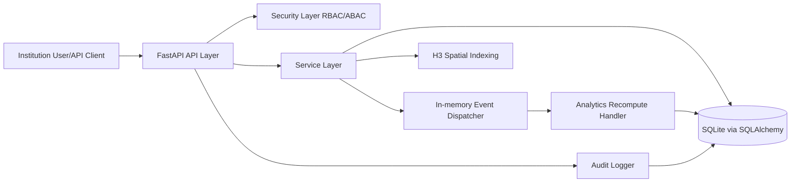

# Institutional Information System Report

## 1. System Framing

### 1.1 Domain and Institutional Problem
Chosen domain: **Environmental monitoring** for institutional and municipal air-quality oversight.

Institutional problem:
- Fragmented sensor data collection from distributed stations.
- Need for controlled access to sensitive environmental data.
- Need for auditable operations (who logged in, who submitted data).
- Need for region-level analytics for governance and operational decisions.

### 1.2 Stakeholders
| Stakeholder | Role | Power | Risk |
|---|---|---|---|
| Environmental Agency Admin | Governance, compliance, access control | High | Misconfiguration of permissions |
| Monitoring Operator | Submits measurements from sensors | Medium | Bad/late data submission |
| Analyst | Consumes analytics for assigned regions | Medium | Unauthorized access to non-assigned regions |
| IT Security Officer | Audits logs and security posture | High | Missed incident due to poor logging |
| Public/City Residents (indirect) | Affected by air quality decisions | Low direct, high impact | Wrong policy decisions due to poor data quality |

### 1.3 System Boundaries
Inside system:
- Authentication and token-based access.
- RBAC authorization.
- ABAC constraint for analytics access by H3 region.
- Measurement ingestion and H3 indexing.
- Event-driven aggregate updates.
- Audit logging for security-critical actions.

Outside system:
- Physical sensor hardware calibration.
- External GIS dashboards.
- Cross-institution identity federation (SSO/LDAP).
- Long-term archival/data lake.

### 1.4 Critical Failure Scenario
Scenario: burst of measurement submissions with dispatcher or DB contention causes delayed aggregate updates.

Impact:
- `Measurement` rows are stored, but `AirQualityAggregate` can lag.

Mitigation idea:
- Make aggregation idempotent by recomputing from source measurements per H3 region.
- Add periodic reconciliation job to recalculate aggregates.
- Emit alert when lag between latest measurement and aggregate `updated_at` exceeds threshold.

## 2. Architecture Overview

### 2.1 Chosen Architecture
**Modular Monolith** (FastAPI application split into core/db/models/services/api/utils modules).

Justification:
- Meets institutional delivery constraints with lower operational overhead than microservices.
- Keeps domain modules separated and maintainable.
- Simplifies security and audit implementation in a single trust boundary.

### 2.2 Architecture Diagram


### 2.3 Event-driven Component
- Event: `measurement.created`.
- Publisher: measurement service after successful insert.
- Subscriber: analytics handler recomputes aggregate for corresponding H3 region.

### 2.4 Basic Failure Handling
- Endpoint-level validation and HTTP error codes.
- Recompute analytics from base measurements (idempotent, reduces drift risk).
- Authorization failures return 401/403 with explicit reason.

### 2.5 H3 Usage in Architecture
- During measurement creation, `(lat, lon)` is transformed into H3 index at resolution 9.
- H3 index stored in `measurements.h3_index`.
- Used for:
  - measurement querying by region,
  - aggregate analytics by region,
  - institutional zoning constraints (ABAC for analysts).

## 3. Data Modeling

### 3.1 Conceptual ER Diagram
```mermaid
erDiagram
    ROLE ||--o{ USER : has
    USER ||--o{ SENSOR : owns
    USER ||--o{ MEASUREMENT : creates
    SENSOR ||--o{ MEASUREMENT : emits
    USER ||--o{ AUDIT_LOG : triggers
    MEASUREMENT }o--|| AIR_QUALITY_AGGREGATE : contributes_to_h3

    ROLE {
        int id PK
        string name
    }
    USER {
        int id PK
        string username
        string password_hash
        int role_id FK
        string assigned_h3_regions
    }
    SENSOR {
        int id PK
        string code
        string description
        int owner_id FK
    }
    MEASUREMENT {
        int id PK
        int sensor_id FK
        int created_by_user_id FK
        float latitude
        float longitude
        string h3_index
        float pm25
        float pm10
        float no2
        float o3
        datetime created_at
    }
    AIR_QUALITY_AGGREGATE {
        int id PK
        string h3_index UNIQUE
        int measurement_count
        float avg_pm25
        float avg_pm10
        float avg_no2
        float avg_o3
        datetime updated_at
    }
    AUDIT_LOG {
        int id PK
        int user_id FK
        string action
        string resource
        string details
        datetime created_at
    }
```

### 3.2 Logical Schema (Tables)
- `roles(id, name)`
- `users(id, username, password_hash, role_id, assigned_h3_regions)`
- `sensors(id, code, description, owner_id)`
- `measurements(id, sensor_id, created_by_user_id, latitude, longitude, h3_index, pm25, pm10, no2, o3, created_at)`
- `air_quality_aggregates(id, h3_index, measurement_count, avg_pm25, avg_pm10, avg_no2, avg_o3, updated_at)`
- `audit_logs(id, user_id, action, resource, details, created_at)`

### 3.3 Required Elements Coverage
- Audit log table: `audit_logs`
- Analytics table: `air_quality_aggregates`
- H3 column: `measurements.h3_index`, `air_quality_aggregates.h3_index`

### 3.4 Short Justification
Model supports ingestion, controlled access, accountability, and regional analytics with minimal operational complexity.

## 4. Security & IAM Design

### 4.1 Roles
- Admin
- Operator
- Analyst

### 4.2 Permission Matrix
| Endpoint | Admin | Operator | Analyst |
|---|---|---|---|
| POST /login | Allow | Allow | Allow |
| POST /measurements | Allow | Allow | Deny |
| GET /measurements/by-h3/{h3_index} | Allow | Allow | Deny |
| GET /analytics/region/{h3_index} | Allow | Allow | Allow with ABAC |
| GET /audit-logs | Allow | Deny | Deny |

### 4.3 ABAC Rule
If user role is `Analyst`, then allow `GET /analytics/region/{h3_index}` only when `h3_index` is in `users.assigned_h3_regions`.

### 4.4 Identified Vulnerability
Current implementation uses in-memory opaque tokens with no expiry and no revocation persistence across process restarts.

Mitigation path:
- Move to signed JWT with expiration.
- Add token revocation/rotation and secure secret management.
- Add rate limiting and lockout on repeated failed login.

## 5. Coding Implementation (Checklist)

- Backend framework: FastAPI
- SQL database: SQLite
- Endpoints: 5+ implemented
- Role-based access control: implemented in dependencies
- Event-driven simulation: in-memory dispatcher + subscriber
- Audit logging: login and measurement creation
- Modular structure: separated modules by responsibility
- H3 integration: stored and queried by H3 index

## 6. In-Class Demo Script

1. Login as `operator` and get token.
2. Create 2-3 measurements in same coordinates.
3. Call `GET /measurements/by-h3/{h3}` and show grouped rows.
4. Call `GET /analytics/region/{h3}` and show updated averages/count.
5. Login as `analyst` and test:
   - access `GET /measurements/by-h3/{h3}` -> 403 (RBAC)
   - allowed H3 -> 200
   - unassigned H3 -> 403 (ABAC)
6. Login as `admin` and call `GET /audit-logs`.
7. Explain architecture and why H3 is used for zoning and aggregation.
